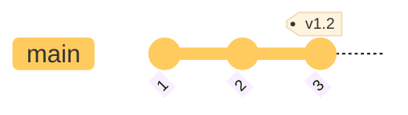
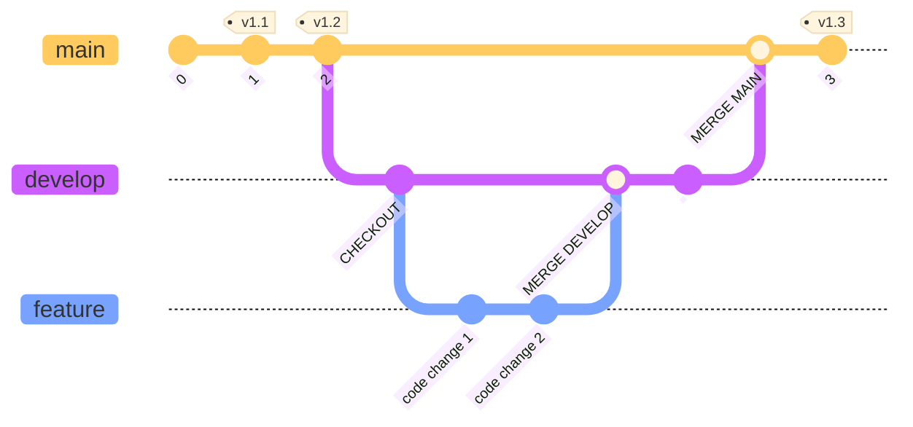
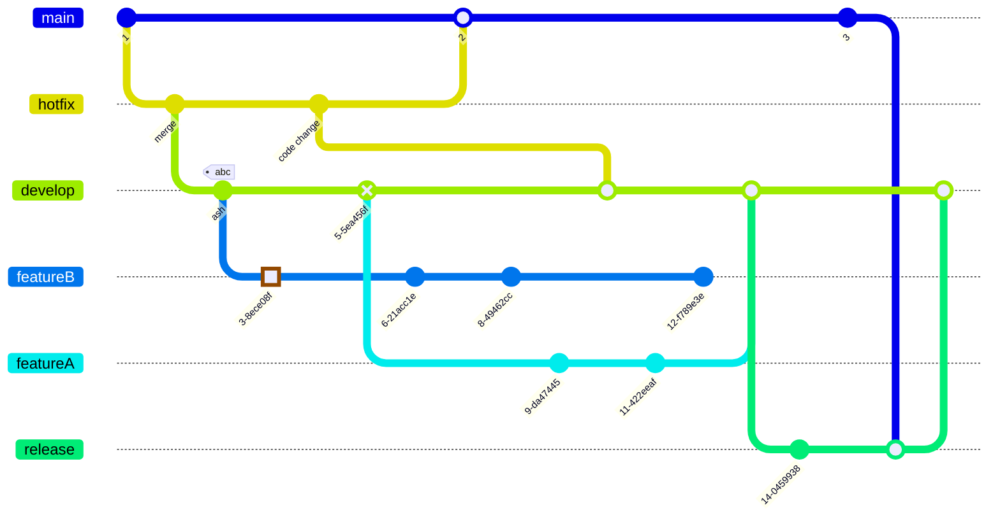

# Table Of Content

[[#GitHub]]
[[#Git]]
- [[#Centralized Workflow]]
- [[#Feature Branch Workflow]]
- [[#Gitflow Workflow]]
- [[#Git Branch Names]]

# GitHub

GitHub is a cloud-based platform where you can store, share and work together with other developers to to write code. A GitHub repository is used to store code and allows you to share your work, track and make changes to your code over time and to collaborate on a shared project with others with out worrying about impacting each before you are ready to integrate changes together. The collaboration is made possible by the open-source software Git, upon which GitHub is built.
# Git

Git is a version control system that track changes to files in a repository. Git enables multiple persons in a group to make changes to the same file at the same time without impacting others changes. This is accomplished by using a Git based workflow. A Got workflow is a set of guidelines and strategies for how a team  of developers use Git to manage their code and collaborate. The workflow defines the branching model, commit practices, and integration methods to make sure that the development process is smooth and efficient.

The Git workflow is at the heart of how project developers collaborate and picking the best suited workflow becomes important. 

## Centralized Workflow

In a centralized workflow developers interact with a single central repository `main` branch which also is the trunk branch in the repository. The repository has a single source of truth where the repository's central `main` branch serve as the record of the project's history. Developers commit directly to the `main` branch and synchronize their local repository by pulling or pushing changes. 
### Key Branches

- **`main` (or master)**: This branch always reflects a production-ready state. All commits on main should correspond to a released version.
### Workflow Steps

1. **Clone:** Each developer clones the central repository to their local machine. Both local and remote repositories have a single `main` branch.
2. **Code & Commit:** Developers make changes and commit them to their local `main` branch.
3. **Pull (Rebase):** Before pushing, the developer pulls the latest changes from the central repository to ensure their local version is up-to-date. This is typically done using `git pull --rebase` to maintain a linear history and avoid unnecessary merge commits.
4. **Push:** After successfully rebasing and verifying the changes, the developer push their updated `main` branch to the central repository.
5. **Conflict Resolution:** If another developer pushed changes in the meantime, the current developer must resolve any merge conflicts locally before they can push.

### Workflow Graph


## Feature Branch Workflow

In a feature branch workflow developers create individual branches for all new features and bug fixes. Feature branches allow for isolated development without impacting the main codebase. Once a feature or bug fix is complete and reviewed, the change is merged back to the `develop` branch where the change is integrated into the larger codebase and integration tested. The integration branch `develop` is in this case an arbitrary name. Think of this branch as an integration branch where individual changes are integrated in the larger application. Since development is not the only phase of a project, additional teams will also need to use the codebase on the integration branch. If the project has a test group or persons then the application needs to be built and deployed for testing.
### Key Branches

- **`main` (or master)**: This branch always reflects a production-ready state. All commits on main should correspond to a released version.
- **`develop`**: This branch integrates all the completed features for the next release. It serves as an integration branch where features are merged and stabilized before being prepared for a release.
### Supporting Branches

- **`feature` branches**: These branches are created from develop to develop new features. They are typically named feature-nnn. Once a feature is complete and tested, it is merged back into develop.
- **`hotfix branches`**: These branches are created directly from main to address critical bugs in a production release. They are typically named hotfix-nnn. Once the hotfix is complete, it is merged into both main (and tagged) and develop.
### Workflow Steps

1. **Initialize**: Before a remote GitHub repository can be used for local development the local project folder needs to be initialized. The command created an empty local Gor repository, a `.git` directory  with subdirectories for objects, head and tag references.

```zsh
	cd </development-path/project-folder>
	git init
```

2. **Clone:** If the local does not yet exist, then each developer clones the central repository to their local machine. This will create a local repository with the `main` branch and integration branches used to combine new features and bug fixes.

```zsh
	git clone <repository-url>
```

2. **Update the main branch:** Developers begin by ensuring their local `main` branch is up-to-date with the remote repository.

```zsh
	git checkout main  # switch to the main branch
	git pull origin main  # integrate changes from the remote (origin) into the current branch 
```

4. **Create a new feature branch:** A new branch is created from the updated `develop` branch for the specific feature or task.

```zsh
	git checkout develop  # switch to the local develop branch
ç	git checkout -b <new-feature-branch>  # create a new branch with the name new-feature-branch-name and check out the new branch
```

5. **Develop the feature:** Developers work on the feature within this new branch, making regular commits to track their progress. Commits are done to the local feature branch.

```zsh
	git checkout <feature-branch>  # switch to the local feature branch
	git add <file-name>  # stage changes in <file-name> to the local feature branch
	git commit -m "commit-message" # create a commit containing the current content of the index and text to explain the commit
```

5. **Push the feature branch:** The feature branch is pushed to the remote repository, making it available for others to see and review.

```zsh
	git checkout <feature-branch>  # switch to the local feature branch
	git push -set-upstream origin <feature-branch>  # used the first time the feature branch is pushed to the remote repository
	git push origin <feature-branch> or git push  # used for consecutive pushes to the remote repository   
```

6. **Create a Pull Request (PR) or Merge Request (MR)**: Once the feature is complete and ready for review, a PR/MR is created for the proposed changes. This initiates a code review process. One person on the project should have the role of 'Release Manager'. This role receives the pull/merge request, reviews the code, approved the request and performs the merge from the feature branch to the integration branch.

7. **Merge the feature branch**: After the code review is complete and the feature is approved, the feature branch is merged into the main or develop branch. This often involves resolving any merge conflicts that may arise.

```zsh
	git checkout <integration-branch>  # change to branch <branch-name>, often the `develop` branch 
	git pull origin <feature-branch>  # integrate changes from the remote (origin) into the current branch 
	git merge <feature-branch>  # merge the changes from the beranch named <feature-branch-name> to the current branch from the got checkout command 
```

8. **Delete the feature branch:** Once merged, the feature branch is deleted (optional), both locally and remotely, as its purpose has been served.

```zsh
	git branch -d f<feature-branch-name> # delete feature branch from local repository
	git push origin --delete <feature-branch-name>  # delete feature btanch from remote (origin) repository
```

### Workflow Branch Graph


## Gitflow Workflow

In a gitflow workflow strict branching structures are defined to manage releases and facilitate parallel development. The gitflow workflow is well suited for projects with scheduled release cycles and a need for clear separation between development, system test/integration test, and production releases. A gitflow workflow introduces a release branch for release preparation. 
### Key Branches

- **`main` (or master)**: This branch always reflects a production-ready state. All commits on main should correspond to a released version.
- **`develop`**: This branch integrates all the completed features for the next release. It serves as an integration branch where features are merged and stabilized before being prepared for a release.
### Supporting Branches:

- **`feature` branches**: These branches are created from develop to develop new features. They are typically named feature-nnn. Once a feature is complete and tested, it is merged back into develop.
- **`release` branches***: When develop contains enough features for a new release, a release branch is created from develop. This branch is used for final testing, bug fixes specific to the release, and preparing for deployment. It is typically named release-vn.n.n. Once the release is ready, it is merged into both main (and tagged with the version number) and back into develop to ensure any release-specific fixes are incorporated.
- **`hotfix branches`**: These branches are created directly from main to address critical bugs in a production release. They are typically named hotfix-nnn. Once the hotfix is complete, it is merged into both main (and tagged) and develop.
### Workflow Steps

1. **Initialize**: Before a remote GitHub repository can be used for local development the local project folder needs to be initialized. The command created an empty local Gor repository, a `.git` directory  with subdirectories for objects, head and tag references.

```zsh
	cd </development-path/project-folder>
	git init
```

2. **Clone:** If the local does not yet exist, then each developer clones the central repository to their local machine. This will create a local repository with the `main` branch and integration branches used to combine new features and bug fixes.

```zsh
	git clone <repository-url>
```

2. **Update the main branch:** Developers begin by ensuring their local `main` branch is up-to-date with the remote repository.

```zsh
	git checkout main  # switch to the main branch
	git pull origin main  # integrate changes from the remote (origin) into the current branch 
```

4. **Create a new feature branch:** A new branch is created from the updated `develop` branch for the specific feature or task.

```zsh
	git checkout develop  # switch to the local develop branch
	git checkout -b <new-feature-branch>  # create a new branch with the name new-feature-branch-name and check out the new branch
```

5. **Develop the feature:** Developers work on the feature within this new branch, making regular commits to track their progress. Commits are done to the local feature branch.

```zsh
	git checkout <feature-branch>  # switch to the local feature branch
	git add <file-name>  # stage changes in <file-name> to the local feature branch
	git commit -m "commit-message" # create a commit containing the current content of the index and text to explain the commit
```

5. **Push the feature branch:** The feature branch is pushed to the remote repository, making it available for others to see and review.

```zsh
	git checkout <feature-branch>  # switch to the local feature branch
	git push -set-upstream origin <feature-branch>  # used the first time the feature branch is pushed to the remote repository
	git push origin <feature-branch> or git push  # used for consecutive pushes to the remote repository   
```

6. **Create a Pull Request (PR) or Merge Request (MR)**: Once the feature is complete and ready for review, a PR/MR is created for the proposed changes. This initiates a code review process. One person on the project should have the role of 'Release Manager'. This role receives the pull/merge request, reviews the code, approved the request and performs the merge from the feature branch to the integration branch.

7. **Merge the feature branch**: After the code review is complete and the feature is approved, the feature branch is merged into the main or develop branch. This often involves resolving any merge conflicts that may arise.

```zsh
	git checkout <integration-branch>  # change to branch <branch-name>, often the `develop` branch 
	git pull origin <feature-branch>  # integrate changes from the remote (origin) into the current branch 
	git merge <feature-branch>  # merge the changes from the beranch named <feature-branch-name> to the current branch from the got checkout command 
```

8. **Prepare a Release**: When the code base i stable the preparation for a release start. Using a dedicated release branch isolates the codebase from new versions of the codebase on the integration branch. Final testing and documentation is done, followed by merging to the main branch and tagging the commit with an identifying version tag.

```zsh
	git checkout <integration-branch>  # change to branch <branch-name>, often the `develop` branch
	git checkout -b <new-release-branch> <integration-branch>  # create a new branch with the name new-feature-branch-name and check out the new branch
```

9. **Bug Fixes**: Bug fixes are done directly on the release branch. Bug fixes are the synched to the integration branch to ensure that ongoing development effort include the bug fix change. This avoid the potential of loosing bug fixes in future releases.

```zsh
	git checkout <release-branch>  # change to branch <release-branch>
	git pull origin <release-branch>  # integrate changes from the remote (origin) release branch into the local release branch
	git checkout -b <new-hotfix-branch>  # create a new branch with the name new-hotfix-branch and check out the new branch
```

10. **Make Hotfix Change**: Making a hotfix change follows the steps as a feature change. The same git commands are use but instead if using a feature branch for the change, the change is done on the hotfix branch.

11. **Merge Hotfix change**: The hotfix change is merged to the release branch and the develop branch. Merging the hotfix change to the develop branch ensures that the hotfix change is integrated into a future release and not lost.

```zsh
	git checkout <release-branch>  # change to branch <release-branch>
	git merge -no-ff <hotfix-branch>  # merge the changes from the hotfix branch to the release branch
	git checkout <integration-branch>  # change to branch <integration-branch>
	git merge -no-ff <hotfix-branch>  # merge/synch the changes from the hotfix branch to the integration branch	
	git push origin <release-branch>  # push hotfix change to remote release branch
	git push origin <integration-branch>  # push hotfix change to remote inteegration branch
```

12. **Finish Release** (Release Manager): When a release testing is complete the codebase is moved from the release branch to the stable `main` branch, followed by a tag identifying the release version. The tagging create a tag for the objects in the release codebase. If conflicts occur during the merge then they have to be resolved here.

```zsh
	git checkout main # change to the main brnch where the releae code base will be merged to
	git pull origin main  # ensire that the local main branch has the latest codebase
	git merge <release-branch>  # merge code from the release branch to main
	git tag -a vx.y.z -m "Release version x.y.z"  # create a version tag across the codebase on main which corresponds to the release version
	git push origin main  # push changes on main to the remote repository
	git push origin --tags  # push the release tag to the remote repository
```

13. **Merge to integration**: After the codebase is merged to main and the release is successful then the codebase is merged to the integration branch. This ensures that any bug fixes or changes made during the release preparation on the release branch are incorporated into continued development. If this step is omitted then there will be opportunities for release changes to be lost in future releases.

```zsh
	git checkout <integration-branch> #  change to the integration branch where the releae code base will be merged to
	git merge <release-branch>  # merge code from the release branch to the integration branch
```

### Workflow Branch Graph


## Git Branch Names

Git branch names should convey clarity, consistency, and ease of understanding for project members. Branch names should clearly indicate the purpose or content of the branch without being excessively long and establish and follow a team-wide convention for naming. Prioritize readability by using appropriate separators and avoiding special characters that might cause issues or confusion.
### Common Conventions

Branch names commonly consists of a prefix followed by a `/` separator and a descriptive suffix, `<prefix>/<suffix>`, for example `feature/jira-59122-new-login-page`. The suffix can consist of a ticket or issue number from a project management tool such as Jira or  GitHub Issues or a concise description of the change. Incorporating the issue ID helps link the branch directly to the task. Use hyphens (`-`) to separate words in the suffix.

- `feature/`: For new features or enhancements.
- `bugfix/` or `fix/`: For fixing bugs.
- `hotfix/`: For urgent bug fixes on production.
- `refactor/`: For code refactoring efforts.
- `chore/`: For maintenance tasks, build process updates, or non-functional changes.
- `docs/`: For documentation-only changes.
- `release/`: For preparing a new release.


